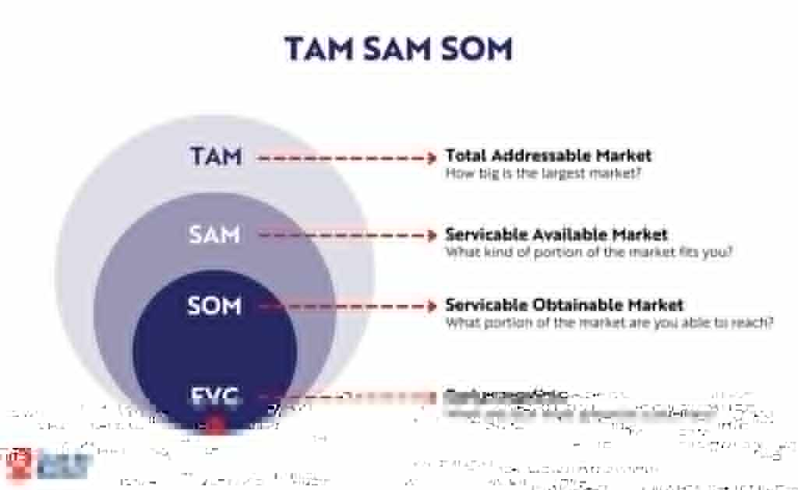

# TAM SAM SOM EVG

## 1. Thông tin tiếp nhận

- **Người mang mô hình vào:**
- **Xuất hiện trong buổi:** Buổi gặp ngày 02-08-2026.
- **Nguồn hình ảnh:** Chưa bổ sung.
- **Lý do được đưa vào:** Thành viên đề xuất làm khung tham khảo cho dự án.
- **Trạng thái hiện tại:** Chưa phân tích, chưa xác nhận áp dụng.

> Ghi chú này chỉ tiếp nhận và phân loại tài liệu. Ý nghĩa của mô hình sẽ được thảo luận riêng, không kết luận trước.

## 2. Câu hỏi dành cho nhóm

Mỗi người xem mô hình và ghi lại:

- Cách mình hiểu mô hình.
- Điểm thấy hữu ích.
- Điểm chưa rõ hoặc cần phản biện.
- Khả năng liên hệ với dự án hiện tại.

## 3. Người tham gia góp ý

| Thành viên | Vai trò xem xét | Trạng thái | Ghi chú |
|---|---|---|---|
|  | Trình bày lại cấu trúc mô hình | Chưa làm |  |
|  | Kiểm tra khả năng áp dụng | Chưa làm |  |
|  | Phản biện điểm không phù hợp | Chưa làm |  |
|  | Liên hệ với mô hình dự án hiện tại | Chưa làm |  |

## 4. Ý kiến ban đầu

### Ý kiến của thành viên 1

### Ý kiến của thành viên 2

### Ý kiến của thành viên 3

## 5. Kết luận sau thảo luận

- [ ] Giữ làm tài liệu tham khảo.
- [ ] Chuyển sang `02 Mở rộng` để phân tích.
- [ ] Tạo vấn đề mới trong `03 Vấn đề`.
- [ ] Áp dụng một phần vào dự án.
- [ ] Không sử dụng.
